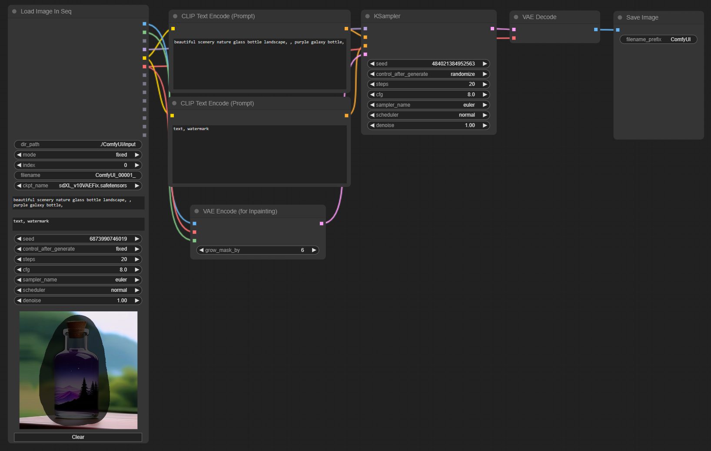

# comfyui-load-image-in-seq

This node is load PNG image sequentially with metadata.

## Features

- Read metadata.
- Load images in sequentially.
- Only support for PNG image that has been generated by ComfyUI.
- Show preview when change index.
- Quick inpaint on preview.

## Usage

- Add node > image > Load Image In Seq

- Change index by arrow key.
- Inpaint > Arrow Right > Inpaint ...

## Update

- 1.0.1

  Reset index when reached end of file.

  Fix: Primitive string -> CLIP Text Encord (Prompt)

- 1.0.2

  Change node name to "Load Image In Seq".

  Remove default values.

  Input values update after change index.

  Loop files in dir_path when set mode to "increment" and Click "Queue Prompt" or set "Auto Queue" mode.

  Parse ckpt_name to MODEL, CLIP, VAE

- 1.0.3

  Supports images it generated with Model DB node.

- 1.0.4
  
  Load all images when change dir_path.

  Move index by arrow key when focus in node.

  Add preview image.

  Add quick inpaint.

## References

- [was-node-suite-comfyui](https://github.com/WASasquatch/was-node-suite-comfyui)
- [comfyui-prompt-reader-node](https://github.com/receyuki/comfyui-prompt-reader-node)