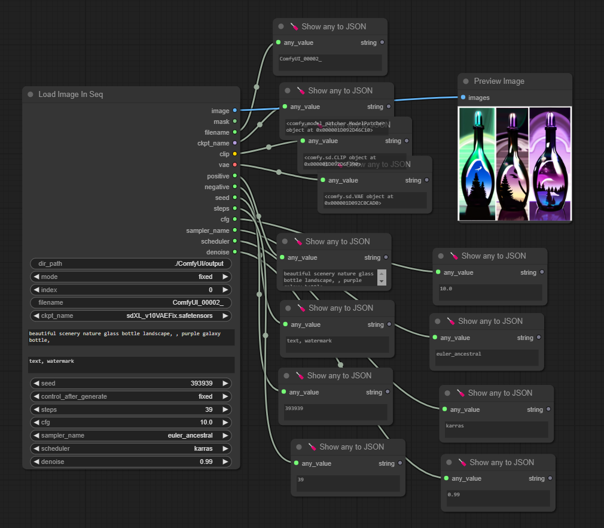

# comfyui-load-image-in-seq

This node is load PNG image sequentially with metadata.

Only support for PNG image that has been generated by ComfyUI.

## Usage

- Add node > image > Load Image In Seq

## Update

- 1.0.1
  Reset index when reached end of file.
  Fix: Primitive string -> CLIP Text Encord (Prompt)

- 1.0.2
  Change node name to "Load Image In Seq".
  Remove default values.
  Input values update after change index.
  Loop files in dir_path when set mode to "increment" and Click "Queue Prompt" or set "Auto Queue" mode.
  Parse ckpt_name to MODEL, CLIP, VAE

## References

- [was-node-suite-comfyui](https://github.com/WASasquatch/was-node-suite-comfyui)
- [comfyui-prompt-reader-node](https://github.com/receyuki/comfyui-prompt-reader-node)