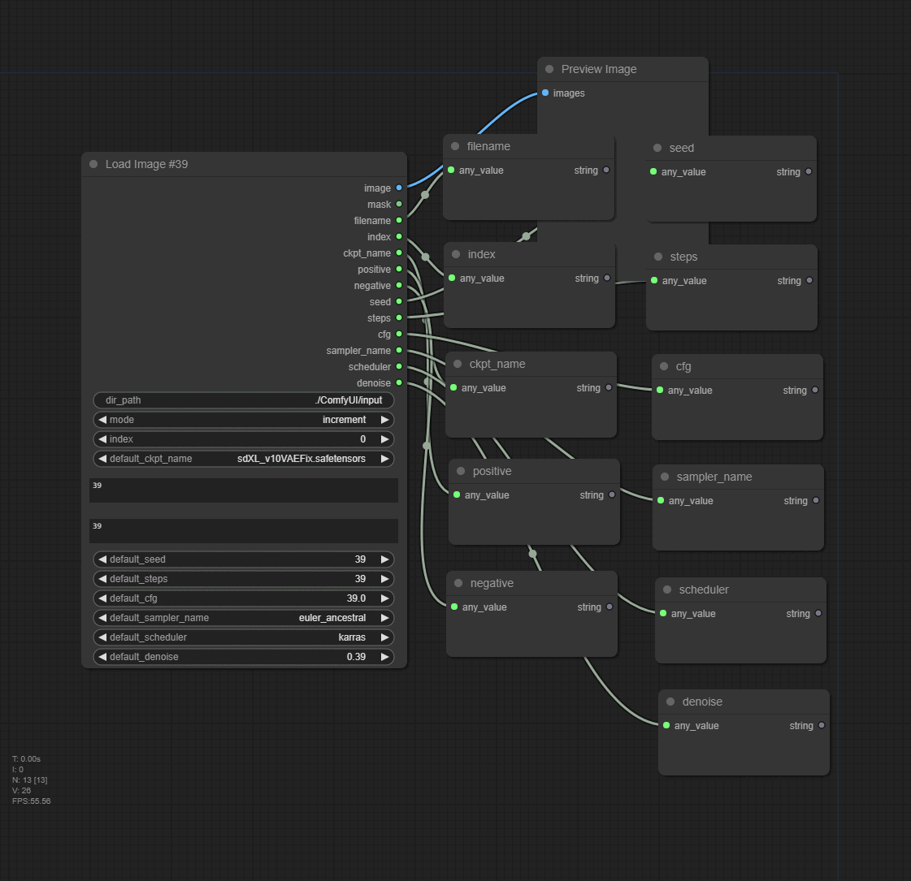

## comfyui-load-image-39

This node is load png image sequentially with metadata.\
Only supported for PNG format that has been created by ComfyUI.
<<<<<<< HEAD

=======
>>>>>>> bdeeaf6e3087d0d8c9b7e7186c3e9c93003cb24e

## Usage

- Add node > image > Load Image #39

<<<<<<< HEAD

=======

- Reset index

Run once after change mode to 'fixed'
>>>>>>> bdeeaf6e3087d0d8c9b7e7186c3e9c93003cb24e

## Credits

- [was-node-suite-comfyui](https://github.com/WASasquatch/was-node-suite-comfyui)
- [comfyui-prompt-reader-node](https://github.com/receyuki/comfyui-prompt-reader-node)